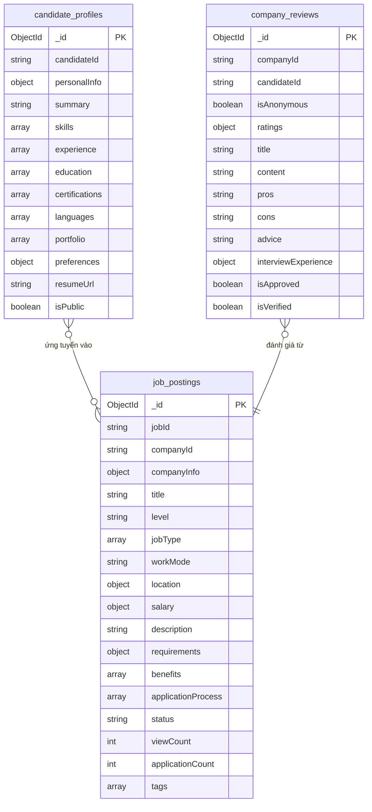
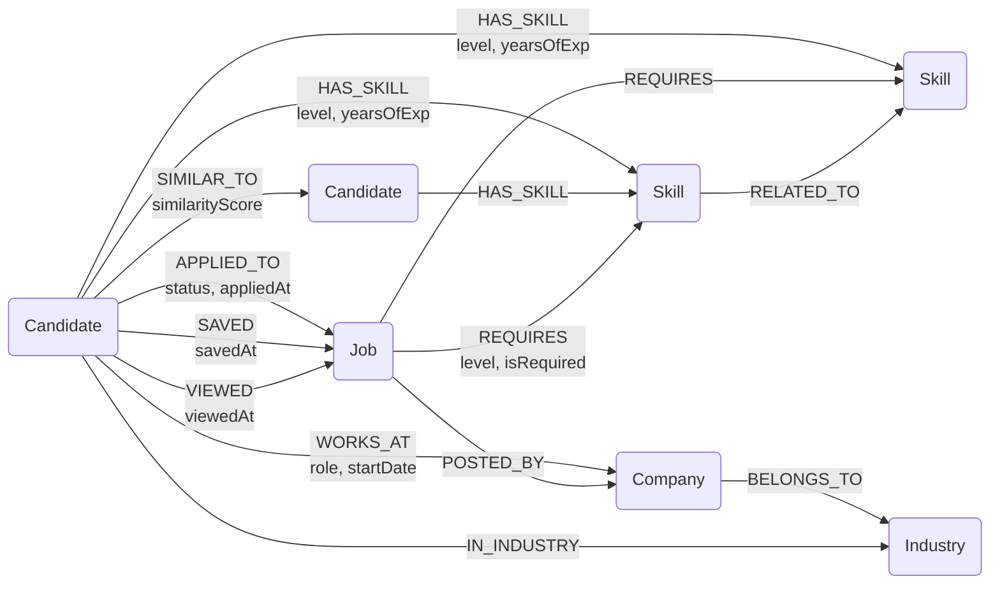
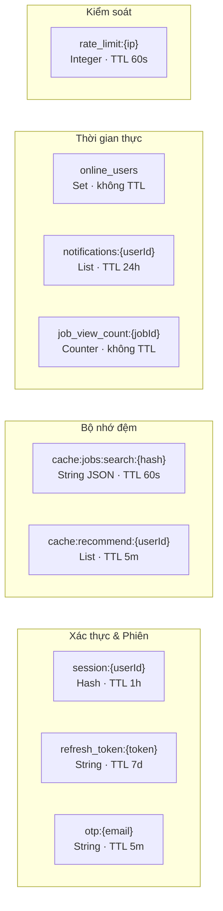

# BÁO CÁO ĐỒ ÁN
# HỆ THỐNG TUYỂN DỤNG THÔNG MINH
### (Smart Recruitment System)

---

> **Môn học:** Cơ sở dữ liệu Quan hệ và NoSQL  
> **Nhóm thực hiện:** [Tên nhóm]  
> **Giảng viên hướng dẫn:** [Tên giảng viên]  
> **Năm học:** 2024 – 2025  

---

## MỤC LỤC

1. [Yêu cầu 1 – Mô tả phạm vi nghiệp vụ hệ thống](#yêu-cầu-1)
2. [Yêu cầu 2 – Phân tích và lựa chọn loại CSDL phù hợp](#yêu-cầu-2)
3. [Yêu cầu 3 – Thiết kế mô hình dữ liệu](#yêu-cầu-3)
4. [Yêu cầu 4 – Cài đặt và triển khai hệ thống](#yêu-cầu-4)
5. [Yêu cầu 5 – Kỹ thuật nâng cao hiệu suất](#yêu-cầu-5)
6. [Kết luận](#kết-luận)
7. [Tài liệu tham khảo](#tài-liệu-tham-khảo)

---

# YÊU CẦU 1: MÔ TẢ PHẠM VI NGHIỆP VỤ HỆ THỐNG

## 1.1. Giới thiệu hệ thống

**Hệ thống Tuyển dụng thông minh (Smart Recruitment System – SRS)** là một nền tảng ứng dụng công nghệ thông tin hiện đại nhằm hỗ trợ toàn bộ quy trình tuyển dụng nhân sự, từ đăng tin tuyển dụng, tiếp nhận hồ sơ ứng viên, đến sàng lọc, phỏng vấn và onboarding. Hệ thống tích hợp các kỹ thuật AI/ML để phân tích và gợi ý ứng viên phù hợp, đồng thời cung cấp công cụ quản lý quy trình tuyển dụng toàn diện cho nhà tuyển dụng (HR).

Hệ thống phục vụ ba nhóm người dùng chính:
- **Ứng viên (Candidate):** Tìm kiếm việc làm, nộp hồ sơ, theo dõi trạng thái ứng tuyển.
- **Nhà tuyển dụng / HR (Recruiter):** Đăng tin, quản lý hồ sơ, lên lịch phỏng vấn.
- **Quản trị viên hệ thống (Admin):** Quản lý toàn bộ nền tảng, người dùng, báo cáo thống kê.

## 1.2. Khảo sát hệ thống thực tế

Hệ thống được xây dựng dựa trên khảo sát các nền tảng tuyển dụng thực tế hiện nay như **LinkedIn**, **TopCV**, **VietnamWorks**, và **ITViec**. Các điểm đặc trưng được tổng hợp:

| Nền tảng | Điểm nổi bật |
|---|---|
| LinkedIn | Mạng xã hội nghề nghiệp, gợi ý kết nối, AI matching |
| TopCV | Thị trường Việt Nam, đa ngành nghề, phân tích CV |
| VietnamWorks | Quản lý hồ sơ, thông báo email, bộ lọc tìm kiếm |
| ITViec | Chuyên IT, đánh giá công ty, cộng đồng lập trình viên |

## 1.3. Các nghiệp vụ chính của hệ thống

- NV01 – Quản lý Tài khoản người dùng: 
Hệ thống hỗ trợ đăng ký, đăng nhập, xác thực tài khoản cho cả ứng viên lẫn nhà tuyển dụng. Người dùng có thể đăng nhập bằng email/mật khẩu.

- NV02 – Quản lý Hồ sơ Ứng viên (CV/Profile)

Ứng viên tạo và duy trì hồ sơ cá nhân bao gồm thông tin cơ bản, kinh nghiệm làm việc, học vấn, kỹ năng, chứng chỉ, portfolio và mức lương kỳ vọng

-  NV03 – Đăng và Quản lý Tin tuyển dụng (Job Posting)

Nhà tuyển dụng tạo tin tuyển dụng với các thuộc tính: tiêu đề, mô tả công việc, yêu cầu kỹ năng, mức lương, địa điểm, loại hình công việc (full-time, part-time, remote), hạn nộp hồ sơ. Tin có thể được đặt ở trạng thái đang tuyển, đã hết hạn, hoặc đã đóng.

-  NV04 – Tìm kiếm và Lọc Công việc / Ứng viên

Ứng viên tìm kiếm công việc theo từ khóa, ngành nghề, địa điểm, mức lương, kinh nghiệm. Hệ thống hỗ trợ tìm kiếm full-text và lọc đa tiêu chí.

- NV05 – Ứng tuyển và Quản lý Hồ sơ ứng tuyển (Application Management)

Ứng viên nộp hồ sơ ứng tuyển vào một vị trí cụ thể. Hệ thống ghi nhận trạng thái từng đơn ứng tuyển theo pipeline: Đã nộp → Đang xem xét → Phỏng vấn → Đề nghị → Từ chối / Trúng tuyển. Nhà tuyển dụng quản lý, lọc và di chuyển hồ sơ qua các bước trong pipeline.

- NV06 – Gợi ý thông minh (AI Matching & Recommendation)

Hệ thống phân tích hồ sơ ứng viên và tin tuyển dụng để gợi ý:
	- Công việc phù hợp cho ứng viên (Job Recommendation).
	- Ứng viên tiềm năng cho nhà tuyển dụng (Candidate Recommendation).
Gợi ý dựa trên lịch sử tìm kiếm, kỹ năng, kinh nghiệm, mức lương và hành vi người dùng.

- NV07 – Phiên đăng nhập (Notification & Messaging)
Hệ thống lưu phiên đăng nhập, lịch sử truy cập và thiết bị đăng nhập.


## 1.4. Bảng tổng hợp nghiệp vụ hệ thống

| Mã NV | Tên nghiệp vụ | Nhóm người dùng | Mức độ ưu tiên |
|---|---|---|---|
| NV01 | Quản lý tài khoản người dùng | Tất cả | Cao |
| NV02 | Quản lý hồ sơ ứng viên | Ứng viên | Cao |
| NV03 | Đăng và quản lý tin tuyển dụng | Nhà tuyển dụng | Cao |
| NV04 | Tìm kiếm và lọc | Tất cả | Cao |
| NV05 | Ứng tuyển và quản lý hồ sơ ứng tuyển | Ứng viên, HR | Cao |
| NV06 | Gợi ý thông minh AI | Tất cả | Cao |
| NV07 | Lưu phiên đăng nhập | Tất cả | Trung bình |

---

# YÊU CẦU 2: PHÂN TÍCH VÀ LỰA CHỌN LOẠI CSDL PHÙ HỢP

## 2.1. Tổng quan về các loại CSDL được xem xét

| Loại CSDL | Đặc điểm | Công nghệ tiêu biểu |
|---|---|---|
| **Relational DB** | Schema cố định, ACID, JOIN phức tạp, phù hợp dữ liệu có cấu trúc | PostgreSQL, MySQL |
| **Document Store** | Schema linh hoạt, lưu JSON/BSON, truy vấn nested document | MongoDB |
| **Key-Value Store** | Đọc/ghi siêu nhanh, lưu cache/session, TTL | Redis |
| **Graph Store** | Lưu quan hệ giữa các thực thể, duyệt đồ thị | Neo4j |

## 2.2. Phân tích từng nghiệp vụ và lựa chọn CSDL

### 2.2.1. NV01 – Quản lý Tài khoản người dùng 
**Relational DB (PostgreSQL)**

**Phân tích:** Dữ liệu tài khoản có cấu trúc rõ ràng, cần đảm bảo tính toàn vẹn (unique email, ràng buộc khóa ngoại). Thông tin người dùng liên kết chặt chẽ với hồ sơ, công ty, đơn ứng tuyển. Cần transaction ACID (ví dụ: tạo tài khoản và hồ sơ công ty trong cùng một transaction).

**Lý do chọn Relational DB:**
- Cấu trúc dữ liệu cố định, có ràng buộc toàn vẹn mạnh.
- Hỗ trợ JOIN với các bảng liên quan.
- Phù hợp với giao dịch ACID khi tạo, cập nhật tài khoản.

### 2.2.2. NV02 – Quản lý Hồ sơ Ứng viên 
**Document Store (MongoDB)**

**Phân tích:** Hồ sơ ứng viên có cấu trúc linh hoạt: mỗi ứng viên có số lượng kinh nghiệm, kỹ năng, học vấn, dự án khác nhau. Không thể định nghĩa schema cứng. Cần lưu trữ dạng document JSON để dễ dàng thêm bớt trường dữ liệu.

**Lý do chọn Document Store (MongoDB):**
- Hồ sơ là document tự nhiên (JSON nested).
- Schema linh hoạt, phù hợp dữ liệu không đồng nhất giữa các ứng viên.
- Hỗ trợ full-text search, aggregate pipeline để phân tích kỹ năng.
- Dễ mở rộng theo chiều ngang khi số lượng hồ sơ tăng.

### 2.2.3. NV03 – Đăng và Quản lý Tin tuyển dụng
**Document Store (MongoDB)**

**Phân tích:** Tương tự hồ sơ ứng viên, mỗi tin tuyển dụng có cấu trúc phong phú và linh hoạt: danh sách yêu cầu kỹ năng, phúc lợi, mô tả công việc dài. Tin tuyển dụng thường được đọc nhiều hơn ghi.

**Lý do chọn Document Store (MongoDB):**
- Lưu toàn bộ thông tin tin đăng trong một document.
- Hỗ trợ full-text search theo tiêu đề, mô tả, kỹ năng.
- Index compound cho tìm kiếm đa tiêu chí (địa điểm + ngành + mức lương).

### 2.2.4. NV04 – Tìm kiếm và Lọc
**Document Store (MongoDB) + Elasticsearch (mở rộng)**

**Phân tích:** Tìm kiếm là nghiệp vụ đọc nhiều, cần hỗ trợ full-text search, fuzzy search, lọc đa tiêu chí đồng thời. MongoDB Atlas Search (hoặc Elasticsearch) phù hợp cho bài toán này.

**Lý do:** MongoDB natively hỗ trợ text index và $search aggregation với Atlas Search. Phù hợp cho tìm kiếm tiếng Việt và tiếng Anh theo tên công việc, kỹ năng, địa điểm.

### 2.2.5. NV05 – Ứng tuyển và Quản lý Pipeline
**Relational DB (PostgreSQL)**

**Phân tích:** Quá trình ứng tuyển là một quy trình có trạng thái, liên kết giữa ứng viên và tin tuyển dụng. Cần đảm bảo tính toàn vẹn (một ứng viên không nộp 2 lần vào cùng một tin), cần JOIN để lấy thông tin đầy đủ, cần transaction khi thay đổi trạng thái.

**Lý do chọn Relational DB:**
- Bảng Application liên kết chặt chẽ Candidate – JobPosting – Recruiter.
- Ràng buộc UNIQUE (candidate_id, job_id) ngăn duplicate.
- Hỗ trợ query phức tạp: đếm hồ sơ theo từng bước pipeline, thống kê.

### 2.2.6. NV06 – Gợi ý thông minh
**Graph Store (Neo4j)**

**Phân tích:** Gợi ý thông minh cần phân tích quan hệ giữa: ứng viên – kỹ năng – công việc – công ty – ngành nghề. Đây là bài toán đồ thị điển hình. Collaborative filtering (ứng viên tương tự nhau về kỹ năng đã ứng tuyển gì) rất phù hợp với Graph DB.

**Lý do chọn Graph Store (Neo4j):**
- Truy vấn gợi ý theo độ sâu quan hệ (Cypher query).
- Phát hiện ứng viên tương tự, công việc liên quan dễ dàng.
- Hiệu suất cao với bài toán duyệt đồ thị nhiều bước.

### 2.2.8. NV07 – Session 
**Key-Value Store (Redis)**

**Phân tích:** Session đăng nhập cần đọc/ghi cực nhanh với TTL (thời gian hết hạn). Thông báo realtime cần pub/sub. Dữ liệu tạm thời không cần lưu lâu dài. Redis là lựa chọn tối ưu.

**Lý do chọn Key-Value Store (Redis):**
- Lưu session token với TTL tự động.
- Pub/Sub cho thông báo realtime (WebSocket).
- Cache kết quả tìm kiếm, cache danh sách gợi ý.
- Tốc độ in-memory cực nhanh (< 1ms).


## 2.3. Bảng tổng hợp phân tích CSDL

| Nghiệp vụ | Loại CSDL | Công nghệ | Lý do chính |
|---|---|---|---|
| NV01 – Tài khoản | Relational | PostgreSQL | ACID, ràng buộc toàn vẹn |
| NV02 – Hồ sơ ứng viên | Document | MongoDB | Schema linh hoạt, JSON nested |
| NV03 – Tin tuyển dụng | Document | MongoDB | Full-text search, linh hoạt |
| NV04 – Tìm kiếm | Document | MongoDB | Text index, aggregate |
| NV05 – Ứng tuyển | Relational | PostgreSQL | JOIN, UNIQUE constraint |
| NV06 – Gợi ý | Graph | Neo4j | Quan hệ đồ thị, Cypher |
| NV07 – Session | Key-Value | Redis | In-memory, TTL, Pub/Sub |

---

# Yêu cầu 3: Thiết kế mô hình dữ liệu

Hệ thống sử dụng kiến trúc đa cơ sở dữ liệu (polyglot persistence), trong đó mỗi loại dữ liệu được lưu trữ bằng công nghệ phù hợp nhất với đặc điểm truy cập và cấu trúc của nó. Cụ thể, hệ thống kết hợp năm loại cơ sở dữ liệu: quan hệ (PostgreSQL), tài liệu (MongoDB), đồ thị (Neo4j), khóa-giá trị (Redis).

## 3.1. PostgreSQL

### Tổng quan

PostgreSQL đảm nhận vai trò lưu trữ dữ liệu cốt lõi của hệ thống — các thực thể có quan hệ ràng buộc chặt chẽ như tài khoản người dùng, hồ sơ ứng viên, thông tin công ty, tin tuyển dụng, đơn ứng tuyển và lịch phỏng vấn. Đây là nguồn dữ liệu tin cậy duy nhất (single source of truth) cho các nghiệp vụ cốt lõi.

Dữ liệu được tổ chức xoay quanh thực thể trung tâm là `users`, từ đó phân nhánh thành `candidates` (ứng viên) và `companies` (nhà tuyển dụng). Mỗi công ty có thể đăng nhiều tin tuyển dụng (`job_postings`), và ứng viên có thể nộp đơn (`applications`) cho các tin đó. Mỗi đơn ứng tuyển có thể dẫn đến một hoặc nhiều buổi phỏng vấn (`interviews`).

### Sơ đồ thực thể quan hệ (ERD)

```mermaid
erDiagram
    users {
        UUID id PK
        string email
        string password_hash
        enum role
        boolean is_active
        timestamp last_login
        timestamp created_at
        timestamp updated_at
    }
    candidates {
        UUID id PK
        UUID user_id FK
        string full_name
        string phone
        date date_of_birth
        string location
        string avatar_url
        text bio
        int expected_salary
        int years_experience
        timestamp created_at
        timestamp updated_at
    }
    companies {
        UUID id PK
        UUID user_id FK
        string name
        string industry
        string size
        string logo_url
        string website
        text description
        text address
        string phone
        string email
        decimal rating
        boolean is_verified
        timestamp created_at
        timestamp updated_at
    }
    job_postings {
        UUID id PK
        UUID company_id FK
        string title
        string level
        string job_type
        string work_mode
        string location
        int salary_min
        int salary_max
        string currency
        enum status
        date deadline
        int application_count
        timestamp created_at
        timestamp updated_at
    }
    applications {
        UUID id PK
        UUID candidate_id FK
        UUID job_id FK
        UUID company_id FK
        enum status
        text cover_letter
        timestamp applied_at
        timestamp updated_at
    }
    interviews {
        UUID id PK
        UUID application_id FK
        UUID candidate_id FK
        UUID job_id FK
        UUID company_id FK
        int round
        timestamp scheduled_at
        int duration_minutes
        enum type
        text location
        text meeting_link
        text interviewer
        text notes
        enum status
        text feedback
        smallint score
        timestamp created_at
        timestamp updated_at
    }

    candidate_profiles {
        UUID candidate_id PK
        text summary
        jsonb skills
        timestamp created_at
        timestamp updated_at
    }

    users ||--o| candidates : "có hồ sơ"
    users ||--o| companies : "quản lý"
    companies ||--o{ job_postings : "đăng tuyển"
    candidates ||--o{ applications : "nộp đơn"
    job_postings ||--o{ applications : "nhận đơn"
    applications ||--o{ interviews : "dẫn đến"
    candidates ||--|| candidate_profiles : "hồ sơ bổ sung"
```



### Các ràng buộc và thành phần bổ sung

Bảng `applications` có ràng buộc duy nhất trên cặp `(candidate_id, job_id)` để ngăn ứng viên nộp đơn trùng lặp cho cùng một vị trí. Trường `role` trong `users` là kiểu liệt kê giới hạn ở ba giá trị: `candidate`, `recruiter` và `admin`. Các trường trạng thái trong `job_postings`, `applications` và `interviews` cũng sử dụng kiểu liệt kê để đảm bảo tính nhất quán.

**Materialized View `mv_pipeline_stats`:** Được tạo để phục vụ dashboard HR, tổng hợp sẵn số lượng đơn ứng tuyển theo từng trạng thái, từng tin tuyển dụng và từng ngày. View này được refresh định kỳ và có unique index trên `(job_id, status, day)` để tăng tốc truy vấn báo cáo.

**Triggers `set_updated_at()`:** Hệ thống sử dụng một trigger function chung được gắn vào tất cả các bảng (users, candidates, companies, job_postings, applications, interviews, candidate_profiles) để tự động cập nhật trường `updated_at` mỗi khi có thao tác UPDATE, đảm bảo tính nhất quán mà không cần xử lý ở tầng ứng dụng.

## 3.2. MongoDB

### Tổng quan

MongoDB lưu trữ các dữ liệu có cấu trúc linh hoạt, thường xuyên thay đổi cấu trúc hoặc cần nhúng nhiều thông tin con vào một tài liệu duy nhất. Hệ thống sử dụng ba collection chính.

**Collection `candidate_profiles`** lưu toàn bộ hồ sơ nghề nghiệp của ứng viên dưới dạng một tài liệu duy nhất, bao gồm thông tin cá nhân, danh sách kỹ năng (với cấp độ và số năm kinh nghiệm), lịch sử làm việc, học vấn, chứng chỉ, ngoại ngữ, portfolio và sở thích việc làm. Cấu trúc nhúng (embedded) cho phép đọc toàn bộ hồ sơ chỉ với một truy vấn.

**Collection `job_postings`** lưu bản mô tả chi tiết tin tuyển dụng, bao gồm thông tin công ty được nhúng trực tiếp (để hiển thị nhanh mà không cần join), yêu cầu kỹ năng cùng mức độ bắt buộc, chế độ đãi ngộ, quy trình tuyển dụng và các thống kê như lượt xem, số đơn nhận được.

**Collection `company_reviews`** lưu đánh giá của ứng viên về công ty sau khi trải qua quy trình phỏng vấn, bao gồm điểm số nhiều chiều (cân bằng công việc-cuộc sống, lương, quản lý, văn hóa...), nhận xét văn bản và mô tả trải nghiệm phỏng vấn.

### Sơ đồ cấu trúc collection



## 3.3. Cơ sở dữ liệu đồ thị – Neo4j

### Tổng quan

Neo4j lưu trữ các mối quan hệ phức tạp giữa ứng viên, việc làm, kỹ năng, công ty và ngành nghề. Đây là nền tảng cho các tính năng gợi ý thông minh và phân tích mạng lưới nghề nghiệp. Thay vì biểu diễn quan hệ bằng khóa ngoại, Neo4j mô hình hóa chúng trực tiếp thành các cạnh có thuộc tính.

Hệ thống định nghĩa năm loại nút (node) chính: `Candidate`, `Job`, `Company`, `Skill` và `Industry`. 
Các mối quan hệ chính bao gồm: ứng viên sở hữu kỹ năng (`HAS_SKILL`), vị trí yêu cầu kỹ năng (`REQUIRES`), ứng viên ứng tuyển vào vị trí (`APPLIED_TO`), ứng viên đã từng làm tại công ty (`WORKS_AT`), tin tuyển dụng thuộc về công ty (`POSTED_BY`), ứng viên có độ tương đồng với nhau (`SIMILAR_TO`), và các kỹ năng liên quan nhau (`RELATED_TO`).

### Sơ đồ đồ thị



### Ứng dụng của mô hình đồ thị

Cấu trúc đồ thị cho phép thực hiện các truy vấn gợi ý phức tạp như: "Tìm các vị trí mà ứng viên có kỹ năng phù hợp và ứng viên tương đồng đã ứng tuyển thành công", hay "Đề xuất kỹ năng còn thiếu dựa trên những vị trí ứng viên quan tâm". Quan hệ `SIMILAR_TO` giữa các ứng viên được tính toán dựa trên độ tương đồng kỹ năng và lịch sử làm việc. Quan hệ `RELATED_TO` giữa các node `Skill` cho phép mở rộng gợi ý theo kỹ năng liên quan (ví dụ: Java → Spring Boot, Docker → Kubernetes). Hệ thống áp dụng constraint unique cho cả 5 loại node (`Candidate`, `Job`, `Skill`, `Company`, `Industry`) để đảm bảo tính toàn vẹn đồ thị.

## 3.4. Cơ sở dữ liệu khóa-giá trị – Redis

### Tổng quan

Redis phục vụ các nhu cầu cần tốc độ truy cập cực cao và dữ liệu có thời gian sống ngắn. Hệ thống tổ chức dữ liệu Redis theo các nhóm chức năng sau đây.

**Quản lý phiên và xác thực:** Lưu trữ session đăng nhập dưới dạng hash với TTL một giờ, refresh token với TTL bảy ngày, và mã OTP xác thực email với TTL năm phút.
### Sơ đồ cấu trúc key-value



---

# YÊU CẦU 4: CÀI ĐẶT VÀ TRIỂN KHAI HỆ THỐNG

## 4.1. Kiến trúc hệ thống tổng quan

```
┌──────────────────────────────────────────────────────────────────┐
│                        CLIENT LAYER                              │
│                          Web App                                 │
└─────────────────────┬────────────────────────────────────────────┘
                      │ HTTP/WebSocket
┌─────────────────────▼────────────────────────────────────────────┐
│                      API GATEWAY / BFF                           │
│             Node.js + Express + JWT Authentication               │
└──┬──────────┬──────────┬──────────┬──────────────────────────────┘
   │          │          │          │         
   ▼          ▼          ▼          ▼          ▼
PostgreSQL  MongoDB    Redis      Neo4j    
(Core DB) (Profiles) (Cache)   (Graph)   
```

## 4.2. Relational DB – PostgreSQL: DDL và DML

### 4.2.1. DDL – Khai báo cấu trúc

```sql
-- Tạo kiểu ENUM
CREATE TYPE user_role AS ENUM ('candidate', 'recruiter', 'admin');
CREATE TYPE application_status AS ENUM ('submitted', 'reviewing', 'interview', 'offered', 'rejected', 'accepted', 'withdrawn');
CREATE TYPE job_status AS ENUM ('draft', 'active', 'expired', 'closed');
CREATE TYPE interview_type AS ENUM ('online', 'offline', 'phone');
CREATE TYPE interview_status AS ENUM ('scheduled', 'completed', 'cancelled', 'rescheduled');

-- Bảng users
CREATE TABLE users (
  id            UUID PRIMARY KEY DEFAULT uuid_generate_v4(),
  email         VARCHAR(255) UNIQUE NOT NULL,
  password_hash VARCHAR(255) NOT NULL,
  role          user_role NOT NULL DEFAULT 'candidate',
  is_active     BOOLEAN NOT NULL DEFAULT TRUE,
  last_login    TIMESTAMP,
  created_at    TIMESTAMP NOT NULL DEFAULT NOW(),
  updated_at    TIMESTAMP NOT NULL DEFAULT NOW()
);

-- Bảng candidates
CREATE TABLE candidates (
  id               UUID PRIMARY KEY DEFAULT gen_random_uuid(),
  user_id          UUID NOT NULL REFERENCES users(id) ON DELETE CASCADE,
  full_name        VARCHAR(200) NOT NULL,
  phone            VARCHAR(20),
  date_of_birth    DATE,
  location         VARCHAR(200),
  avatar_url       TEXT,
  bio              TEXT,
  expected_salary  INTEGER,
  years_experience INTEGER DEFAULT 0,
  created_at       TIMESTAMP DEFAULT NOW(),
  updated_at       TIMESTAMP DEFAULT NOW()
);

-- Bảng companies
CREATE TABLE companies (
  id          UUID PRIMARY KEY DEFAULT gen_random_uuid(),
  user_id     UUID NOT NULL REFERENCES users(id),
  name        VARCHAR(255) NOT NULL,
  industry    VARCHAR(100),
  size        VARCHAR(50),
  logo_url    TEXT,
  website     VARCHAR(255),
  description TEXT,
  address     TEXT,
  rating      DECIMAL(3,2) DEFAULT 0,
  created_at  TIMESTAMP DEFAULT NOW(),
  updated_at  TIMESTAMP DEFAULT NOW()
);

-- Bảng job_postings
CREATE TABLE job_postings (
  id           UUID PRIMARY KEY DEFAULT gen_random_uuid(),
  company_id   UUID NOT NULL REFERENCES companies(id) ON DELETE CASCADE,
  title        VARCHAR(255) NOT NULL,
  level        VARCHAR(50),
  job_type     VARCHAR(50),
  work_mode    VARCHAR(50),
  location     VARCHAR(200),
  salary_min   INTEGER,
  salary_max   INTEGER,
  currency     VARCHAR(10) DEFAULT 'VND',
  description  TEXT,
  status       job_status DEFAULT 'draft',
  deadline     DATE,
  view_count   INTEGER DEFAULT 0,
  created_at   TIMESTAMP DEFAULT NOW(),
  updated_at   TIMESTAMP DEFAULT NOW()
);

-- Bảng applications
CREATE TABLE applications (
  id           UUID PRIMARY KEY DEFAULT uuid_generate_v4(),
  candidate_id UUID NOT NULL REFERENCES candidates(id) ON DELETE CASCADE,
  job_id       UUID NOT NULL REFERENCES job_postings(id) ON DELETE CASCADE,
  company_id   UUID NOT NULL REFERENCES companies(id),
  status       application_status NOT NULL DEFAULT 'submitted',
  cover_letter TEXT,
  applied_at   TIMESTAMP NOT NULL DEFAULT NOW(),
  updated_at   TIMESTAMP NOT NULL DEFAULT NOW(),
  CONSTRAINT uq_application UNIQUE (candidate_id, job_id)
);

-- Bảng interviews
CREATE TABLE interviews (
  id               UUID PRIMARY KEY DEFAULT uuid_generate_v4(),
  application_id   UUID NOT NULL REFERENCES applications(id) ON DELETE CASCADE,
  candidate_id     UUID NOT NULL REFERENCES candidates(id),
  job_id           UUID NOT NULL REFERENCES job_postings(id),
  company_id       UUID NOT NULL REFERENCES companies(id),
  round            INTEGER NOT NULL DEFAULT 1,
  scheduled_at     TIMESTAMP NOT NULL,
  duration_minutes INTEGER NOT NULL DEFAULT 60,
  type             interview_type NOT NULL DEFAULT 'online',
  location         TEXT,
  meeting_link     TEXT,
  interviewer      TEXT,
  notes            TEXT,
  status           interview_status NOT NULL DEFAULT 'scheduled',
  feedback         TEXT,
  score            SMALLINT CHECK (score BETWEEN 1 AND 10),
  created_at       TIMESTAMP NOT NULL DEFAULT NOW(),
  updated_at       TIMESTAMP NOT NULL DEFAULT NOW()
);

-- Indexes
CREATE INDEX idx_applications_candidate ON applications(candidate_id);
CREATE INDEX idx_applications_job ON applications(job_id);
CREATE INDEX idx_applications_status ON applications(status);
CREATE INDEX idx_job_postings_company ON job_postings(company_id);
CREATE INDEX idx_job_postings_status ON job_postings(status);
CREATE INDEX idx_job_postings_deadline ON job_postings(deadline);
CREATE INDEX idx_interviews_application ON interviews(application_id);
CREATE INDEX idx_interviews_scheduled ON interviews(scheduled_at);
```

### 4.2.2. DML – Thao tác dữ liệu

```sql
-- 1. Đăng ký ứng viên mới (transaction)
BEGIN;
  INSERT INTO users (email, password_hash, role)
  VALUES ('an.nguyen@email.com', '$2b$10$...', 'candidate')
  RETURNING id, email, role, created_at;

  INSERT INTO candidates (user_id, full_name, phone, location)
  VALUES ($1, 'Nguyễn Văn An', '0901234567', 'Hồ Chí Minh')
  RETURNING id;
COMMIT;

-- 2. Đăng nhập – lấy thông tin user kèm candidate/company
SELECT u.id, u.email, u.password_hash, u.role, u.is_active,
       c.id  AS candidate_id,
       co.id AS company_id
FROM users u
LEFT JOIN candidates c  ON c.user_id  = u.id
LEFT JOIN companies  co ON co.user_id = u.id
WHERE u.email = $1;

-- Cập nhật thời điểm đăng nhập cuối
UPDATE users SET last_login = NOW() WHERE id = $1;

-- 3. Tạo tin tuyển dụng
INSERT INTO job_postings
  (company_id, title, level, job_type, work_mode,
   location, salary_min, salary_max, currency, status, deadline)
VALUES ($1,$2,$3,$4,$5,$6,$7,$8,$9,'active',$10)
RETURNING id, created_at;

-- 4. Cập nhật thông tin tin tuyển dụng (chỉ các trường được cung cấp)
UPDATE job_postings
SET title      = COALESCE($1, title),
    job_type   = COALESCE($2, job_type),
    location   = COALESCE($3, location),
    salary_min = COALESCE($4, salary_min),
    salary_max = COALESCE($5, salary_max),
    deadline   = COALESCE($6, deadline),
    status     = COALESCE($7, status),
    updated_at = NOW()
WHERE id = $8 AND company_id = $9
RETURNING id;

-- 5. Nộp đơn ứng tuyển
-- Kiểm tra trùng lặp
SELECT id FROM applications
WHERE candidate_id = $1 AND job_id = $2 AND status != 'withdrawn';

-- Chèn đơn ứng tuyển
INSERT INTO applications (candidate_id, job_id, company_id, cover_letter)
VALUES ($1, $2, $3, $4)
RETURNING id, status, applied_at;

-- Tăng bộ đếm đơn của tin tuyển dụng
UPDATE job_postings
SET application_count = application_count + 1
WHERE id = $1;

-- 6. Lấy danh sách đơn ứng tuyển (phía HR) kèm thông tin ứng viên và kỹ năng
SELECT a.id, a.candidate_id, a.status, a.applied_at,
       ca.full_name, ca.phone, ca.location,
       cp.summary, cp.skills
FROM applications a
JOIN candidates        ca ON ca.id           = a.candidate_id
LEFT JOIN candidate_profiles cp ON cp.candidate_id = a.candidate_id
WHERE a.job_id = $1 AND a.company_id = $2
ORDER BY a.applied_at DESC
LIMIT $3 OFFSET $4;

-- 7. Thống kê pipeline tuyển dụng của một tin
SELECT status, COUNT(*) AS count
FROM applications
WHERE job_id = $1 AND company_id = $2
GROUP BY status;

-- 8. Cập nhật trạng thái đơn ứng tuyển
UPDATE applications
SET status = $1, updated_at = NOW()
WHERE id = $2 AND company_id = $3
RETURNING id, status;

-- 9. Lên lịch phỏng vấn
INSERT INTO interviews
  (application_id, candidate_id, job_id, company_id,
   scheduled_at, type, location, meeting_link, interviewer, notes)
VALUES ($1,$2,$3,$4,$5,$6,$7,$8,$9,$10)
RETURNING id, status, scheduled_at, type;

-- Đồng thời chuyển đơn sang trạng thái "interview"
UPDATE applications SET status = 'interview', updated_at = NOW()
WHERE id = $1;

-- 10. Lấy lịch phỏng vấn của công ty (có lọc theo trạng thái và ngày)
SELECT i.id, i.scheduled_at, i.type, i.status,
       i.location, i.meeting_link, i.interviewer, i.notes,
       ca.full_name AS candidate_name, ca.phone,
       u.email      AS candidate_email,
       j.title      AS job_title
FROM interviews i
JOIN applications a  ON a.id  = i.application_id
JOIN candidates  ca ON ca.id = a.candidate_id
JOIN users        u  ON u.id  = ca.user_id
JOIN job_postings j  ON j.id  = i.job_id
WHERE i.company_id = $1
ORDER BY i.scheduled_at ASC
LIMIT $2 OFFSET $3;

-- 11. Ghi nhận kết quả phỏng vấn (điểm số + phản hồi)
UPDATE interviews
SET status = $1, score = $2, feedback = $3, notes = $4, updated_at = NOW()
WHERE id = $5 AND company_id = $6
RETURNING id, status, score, feedback;

-- 12. Thống kê dashboard nhà tuyển dụng
SELECT
  COUNT(*)                                           AS total_applications,
  COUNT(*) FILTER (WHERE status = 'submitted')       AS submitted,
  COUNT(*) FILTER (WHERE status = 'reviewing')       AS reviewing,
  COUNT(*) FILTER (WHERE status = 'interview')       AS interview,
  COUNT(*) FILTER (WHERE status = 'offered')         AS offered,
  COUNT(*) FILTER (WHERE status = 'rejected')        AS rejected,
  COUNT(*) FILTER (WHERE DATE(applied_at) = CURRENT_DATE) AS today_applications
FROM applications
WHERE company_id = $1;

-- 13. Xu hướng nộp đơn 30 ngày gần nhất (theo công ty)
SELECT DATE(applied_at) AS date, COUNT(*) AS count
FROM applications
WHERE company_id = $1
  AND applied_at >= NOW() - INTERVAL '30 days'
GROUP BY DATE(applied_at)
ORDER BY date;

-- 14. Thống kê người dùng toàn hệ thống (Admin)
SELECT
  COUNT(*) FILTER (WHERE role = 'candidate')                    AS total_candidates,
  COUNT(*) FILTER (WHERE role = 'recruiter')                    AS total_recruiters,
  COUNT(*) FILTER (WHERE is_active = FALSE)                     AS inactive_users,
  COUNT(*) FILTER (WHERE last_login >= NOW() - INTERVAL '7 days') AS active_last_7d
FROM users;

-- 15. Thống kê tin tuyển dụng toàn hệ thống (Admin)
SELECT
  COUNT(*) FILTER (WHERE status = 'active')           AS active_jobs,
  COUNT(*) FILTER (WHERE status = 'draft')            AS draft_jobs,
  COUNT(*) FILTER (WHERE status = 'closed')           AS closed_jobs,
  COUNT(*) FILTER (WHERE deadline < NOW())            AS expired_jobs
FROM job_postings;
```

## 4.3. Document Store – MongoDB: Khai báo và thao tác

### 4.3.1. Khởi tạo collection và indexes

```javascript
// Kết nối MongoDB
const { MongoClient } = require('mongodb');
const client = new MongoClient('mongodb://localhost:27017');
const db = client.db('smart_recruitment');

// Tạo collection candidate_profiles với validation
await db.createCollection('candidate_profiles', {
  validator: {
    $jsonSchema: {
      bsonType: 'object',
      required: ['candidateId', 'userId', 'personalInfo'],
      properties: {
        candidateId: { bsonType: 'string' },
        userId: { bsonType: 'string' },
        personalInfo: {
          bsonType: 'object',
          required: ['fullName'],
          properties: {
            fullName: { bsonType: 'string' }
          }
        }
      }
    }
  }
});

// Indexes cho candidate_profiles
await db.collection('candidate_profiles').createIndex({ candidateId: 1 }, { unique: true });
await db.collection('candidate_profiles').createIndex({ 'skills.name': 1 });
await db.collection('candidate_profiles').createIndex({ 'preferences.preferredLocations': 1 });
await db.collection('candidate_profiles').createIndex({
  'personalInfo.fullName': 'text',
  'summary': 'text',
  'skills.name': 'text'
}, { name: 'candidate_text_search' });

// Indexes cho job_postings
await db.collection('job_postings').createIndex({ jobId: 1 }, { unique: true });
await db.collection('job_postings').createIndex({ status: 1, deadline: 1 });
await db.collection('job_postings').createIndex({ 'location.city': 1 });
await db.collection('job_postings').createIndex({ 'requirements.skills.name': 1 });
await db.collection('job_postings').createIndex({ 'salary.min': 1, 'salary.max': 1 });
await db.collection('job_postings').createIndex({
  title: 'text',
  description: 'text',
  tags: 'text'
}, { name: 'job_text_search' });
```

### 4.3.2. DML – Thao tác dữ liệu MongoDB

```javascript
// 1. Tạo hồ sơ ứng viên mới
const candidateProfile = {
  candidateId: 'candidate_001',
  userId: 'user_001',
  personalInfo: {
    fullName: 'Nguyễn Văn An',
    email: 'an.nguyen@email.com',
    location: 'Hồ Chí Minh'
  },
  skills: [
    { name: 'Java', level: 'Advanced', yearsOfExp: 4 },
    { name: 'Spring Boot', level: 'Advanced', yearsOfExp: 3 }
  ],
  experience: [],
  education: [],
  isPublic: true,
  createdAt: new Date(),
  updatedAt: new Date()
};
await db.collection('candidate_profiles').insertOne(candidateProfile);

// 2. Cập nhật thêm kinh nghiệm làm việc
await db.collection('candidate_profiles').updateOne(
  { candidateId: 'candidate_001' },
  {
    $push: {
      experience: {
        company: 'Công ty XYZ',
        role: 'Senior Backend Developer',
        startDate: '2022-01',
        endDate: null,
        isCurrent: true,
        description: 'Phát triển microservices...'
      }
    },
    $set: { updatedAt: new Date() }
  }
);

// 3. Tìm kiếm ứng viên theo kỹ năng (phù hợp cho tin tuyển dụng)
const matchingCandidates = await db.collection('candidate_profiles').find({
  'skills.name': { $all: ['Java', 'Spring Boot'] },
  'preferences.preferredLocations': { $in: ['Hồ Chí Minh', 'Remote'] },
  isPublic: true
}).project({
  candidateId: 1,
  'personalInfo.fullName': 1,
  skills: 1,
  'preferences.expectedSalary': 1
}).limit(20).toArray();

// 4. Full-text search tin tuyển dụng
const jobResults = await db.collection('job_postings').find({
  $text: { $search: 'senior backend java spring boot' },
  status: 'active',
  deadline: { $gte: new Date() }
}, {
  score: { $meta: 'textScore' }
}).sort({
  score: { $meta: 'textScore' }
}).limit(10).toArray();

// 5. Lọc công việc theo nhiều tiêu chí
const filteredJobs = await db.collection('job_postings').find({
  status: 'active',
  'location.city': { $in: ['Hồ Chí Minh', 'Hà Nội'] },
  'salary.min': { $gte: 20000000 },
  'requirements.skills.name': { $in: ['Java', 'Python'] },
  deadline: { $gte: new Date() }
}).sort({ createdAt: -1 }).skip(0).limit(20).toArray();

// 6. Aggregate: Top kỹ năng được yêu cầu nhiều nhất
const topSkills = await db.collection('job_postings').aggregate([
  { $match: { status: 'active' } },
  { $unwind: '$requirements.skills' },
  { $group: { _id: '$requirements.skills.name', count: { $sum: 1 } } },
  { $sort: { count: -1 } },
  { $limit: 10 }
]).toArray();

// 7. Aggregate: Thống kê mức lương theo ngành
const salaryStats = await db.collection('job_postings').aggregate([
  { $match: { status: 'active', 'salary.isPublic': true } },
  {
    $group: {
      _id: '$companyInfo.industry',
      avgSalaryMin: { $avg: '$salary.min' },
      avgSalaryMax: { $avg: '$salary.max' },
      jobCount: { $sum: 1 }
    }
  },
  { $sort: { avgSalaryMax: -1 } }
]).toArray();
```

## 4.4. Graph Store – Neo4j: Khai báo và thao tác

### 4.4.1. DDL – Tạo constraints và indexes

```cypher
// Constraints (đảm bảo tính duy nhất)
CREATE CONSTRAINT candidate_id IF NOT EXISTS FOR (c:Candidate) REQUIRE c.id IS UNIQUE;
CREATE CONSTRAINT job_id IF NOT EXISTS FOR (j:Job) REQUIRE j.id IS UNIQUE;
CREATE CONSTRAINT company_id IF NOT EXISTS FOR (co:Company) REQUIRE co.id IS UNIQUE;
CREATE CONSTRAINT skill_name IF NOT EXISTS FOR (s:Skill) REQUIRE s.name IS UNIQUE;

// Indexes
CREATE INDEX candidate_location IF NOT EXISTS FOR (c:Candidate) ON (c.location);
CREATE INDEX job_status IF NOT EXISTS FOR (j:Job) ON (j.status);
CREATE INDEX skill_category IF NOT EXISTS FOR (s:Skill) ON (s.category);
```

### 4.4.2. DML – Thao tác dữ liệu Neo4j

```cypher
// 1. Tạo node Candidate và kỹ năng, liên kết
MERGE (c:Candidate {id: 'candidate_001'})
  SET c.name = 'Nguyễn Văn An', c.location = 'Hồ Chí Minh', c.yearsExp = 4;

MERGE (s1:Skill {name: 'Java'}) SET s1.category = 'Programming Language';
MERGE (s2:Skill {name: 'Spring Boot'}) SET s2.category = 'Framework';
MERGE (s3:Skill {name: 'PostgreSQL'}) SET s3.category = 'Database';

MATCH (c:Candidate {id: 'candidate_001'}), (s:Skill {name: 'Java'})
MERGE (c)-[:HAS_SKILL {level: 'Advanced', yearsOfExp: 4}]->(s);

MATCH (c:Candidate {id: 'candidate_001'}), (s:Skill {name: 'Spring Boot'})
MERGE (c)-[:HAS_SKILL {level: 'Advanced', yearsOfExp: 3}]->(s);

// 2. Tạo Job và yêu cầu kỹ năng
MERGE (j:Job {id: 'job_001'})
  SET j.title = 'Senior Backend Developer', j.level = 'Senior', 
      j.status = 'active', j.location = 'Hồ Chí Minh';

MATCH (j:Job {id: 'job_001'}), (s:Skill {name: 'Java'})
MERGE (j)-[:REQUIRES {isRequired: true}]->(s);

MATCH (j:Job {id: 'job_001'}), (s:Skill {name: 'Spring Boot'})
MERGE (j)-[:REQUIRES {isRequired: true}]->(s);

// 3. Ghi nhận ứng tuyển
MATCH (c:Candidate {id: 'candidate_001'}), (j:Job {id: 'job_001'})
MERGE (c)-[:APPLIED_TO {appliedAt: datetime(), status: 'submitted'}]->(j);

// 4. GỢI Ý VIỆC LÀM cho ứng viên (Job Recommendation)
// Tìm công việc có kỹ năng trùng khớp mà ứng viên chưa ứng tuyển
MATCH (c:Candidate {id: 'candidate_001'})-[:HAS_SKILL]->(s:Skill)<-[:REQUIRES]-(j:Job)
WHERE j.status = 'active'
  AND NOT (c)-[:APPLIED_TO]->(j)
WITH j, COUNT(s) AS matchScore
RETURN j.id, j.title, j.location, matchScore
ORDER BY matchScore DESC
LIMIT 10;

// 5. GỢI Ý ỨNG VIÊN cho nhà tuyển dụng (Candidate Recommendation)
// Tìm ứng viên có kỹ năng phù hợp với tin tuyển dụng
MATCH (j:Job {id: 'job_001'})-[:REQUIRES]->(s:Skill)<-[:HAS_SKILL]-(c:Candidate)
WHERE NOT (c)-[:APPLIED_TO]->(j)
WITH c, COUNT(s) AS matchScore, COLLECT(s.name) AS matchedSkills
RETURN c.id, c.name, c.location, matchScore, matchedSkills
ORDER BY matchScore DESC
LIMIT 20;

// 6. Collaborative Filtering: Tìm ứng viên tương tự
// (những người đã ứng tuyển vào công việc tương tự)
MATCH (c1:Candidate {id: 'candidate_001'})-[:APPLIED_TO]->(j:Job)<-[:APPLIED_TO]-(c2:Candidate)
WHERE c1 <> c2
WITH c2, COUNT(j) AS commonJobs
ORDER BY commonJobs DESC
LIMIT 5;

// 7. Gợi ý nâng cao: Jobs qua ứng viên tương tự (2-hop)
MATCH (c1:Candidate {id: 'candidate_001'})-[:HAS_SKILL]->(s:Skill)<-[:HAS_SKILL]-(c2:Candidate)
  -[:APPLIED_TO]->(j:Job)
WHERE c1 <> c2
  AND j.status = 'active'
  AND NOT (c1)-[:APPLIED_TO]->(j)
WITH j, COUNT(DISTINCT c2) AS socialScore
RETURN j.id, j.title, socialScore
ORDER BY socialScore DESC
LIMIT 10;

// 8. Tính điểm tương đồng giữa các ứng viên (Jaccard similarity)
MATCH (c1:Candidate {id: 'candidate_001'})-[:HAS_SKILL]->(s:Skill)
WITH c1, COLLECT(s.name) AS skills1
MATCH (c2:Candidate)-[:HAS_SKILL]->(s2:Skill)
WHERE c1 <> c2
WITH c1, skills1, c2, COLLECT(s2.name) AS skills2
WITH c1, c2,
  SIZE([x IN skills1 WHERE x IN skills2]) AS intersection,
  SIZE(skills1 + [x IN skills2 WHERE NOT x IN skills1]) AS union_size
WHERE union_size > 0
RETURN c2.id, c2.name, toFloat(intersection)/union_size AS jaccardScore
ORDER BY jaccardScore DESC
LIMIT 10;
```

## 4.5. Key-Value Store – Redis: Khai báo và thao tác

### 4.5.1. Quản lý Session và Authentication

```javascript
const redis = require('redis');
const client = redis.createClient({ url: 'redis://localhost:6379' });

// 1. Lưu session khi đăng nhập thành công
async function saveSession(userId, sessionData) {
  const key = `session:${userId}`;
  await client.hSet(key, {
    userId: sessionData.userId,
    email: sessionData.email,
    role: sessionData.role,
    loginAt: new Date().toISOString()
  });
  await client.expire(key, 3600); // 1 giờ
}

// 2. Lấy thông tin session
async function getSession(userId) {
  return await client.hGetAll(`session:${userId}`);
}

// 3. Xóa session khi đăng xuất
async function destroySession(userId) {
  await client.del(`session:${userId}`);
}

// 4. Lưu OTP xác thực email
async function saveOTP(email, otp) {
  await client.set(`otp:${email}`, otp, { EX: 300 }); // 5 phút
}

// 5. Rate limiting (giới hạn request)
async function checkRateLimit(ip) {
  const key = `rate_limit:${ip}`;
  const count = await client.incr(key);
  if (count === 1) await client.expire(key, 60);
  return count <= 100; // max 100 request/phút
}

// 6. Cache kết quả tìm kiếm
async function cacheSearchResults(queryHash, results) {
  const key = `cache:jobs:search:${queryHash}`;
  await client.set(key, JSON.stringify(results), { EX: 60 });
}

async function getCachedSearch(queryHash) {
  const cached = await client.get(`cache:jobs:search:${queryHash}`);
  return cached ? JSON.parse(cached) : null;
}

// 7. Pub/Sub cho thông báo realtime
const publisher = redis.createClient();
const subscriber = redis.createClient();

// Gửi thông báo
async function sendNotification(userId, notification) {
  await publisher.publish(
    `notifications:${userId}`,
    JSON.stringify(notification)
  );
}

// Nhận thông báo (WebSocket server)
await subscriber.subscribe(`notifications:user_001`, (message) => {
  const notification = JSON.parse(message);
  // Gửi qua WebSocket đến client
  wsClient.send(JSON.stringify(notification));
});
```

---

# KẾT LUẬN

## Tóm tắt kết quả đạt được

Đồ án đã hoàn thành việc phân tích, thiết kế và triển khai **Hệ thống Tuyển dụng Thông minh** với kiến trúc đa CSDL (Polyglot Persistence), bao gồm:

| Yêu cầu | Kết quả |
|---|---|
| YC1 – Nghiệp vụ | Xác định 7 nghiệp vụ chính với mô tả chi tiết |
| YC2 – Phân tích CSDL | Lựa chọn và lý giải 4 loại CSDL phù hợp cho từng nghiệp vụ |
| YC3 – Thiết kế dữ liệu | ERD PostgreSQL, 3 MongoDB collections, Neo4j graph model, Redis data model, 3 Cassandra tables |
| YC4 – Cài đặt | DDL + DML đầy đủ cho PostgreSQL, MongoDB, Neo4j, Redis, Cassandra; thiết kế UI và kết nối backend Node.js |

## Bài học rút ra

Việc áp dụng kiến trúc **Polyglot Persistence** – sử dụng nhiều loại CSDL khác nhau, mỗi loại phù hợp nhất với một nhóm nghiệp vụ – là xu hướng tất yếu trong các hệ thống thông tin hiện đại. Không có một loại CSDL nào "tốt nhất" cho mọi bài toán. Chìa khóa là hiểu rõ đặc thù của từng loại CSDL và khớp nó với đặc thù nghiệp vụ cần giải quyết.

---

# TÀI LIỆU THAM KHẢO

1. Martin Fowler & Pramod Sadalage (2012). *NoSQL Distilled: A Brief Guide to the Emerging World of Polyglot Persistence*. Addison-Wesley.
2. PostgreSQL Documentation (2024). *PostgreSQL 16 Official Docs*. https://www.postgresql.org/docs/
3. MongoDB Documentation (2024). *MongoDB Manual*. https://www.mongodb.com/docs/
4. Neo4j Documentation (2024). *Neo4j Graph Data Science Library*. https://neo4j.com/docs/
5. Redis Documentation (2024). *Redis Commands Reference*. https://redis.io/commands/
7. Kleppmann, M. (2017). *Designing Data-Intensive Applications*. O'Reilly Media.
8. Sadalage, P. J., & Fowler, M. (2012). *NoSQL Distilled*. Pearson Education.
